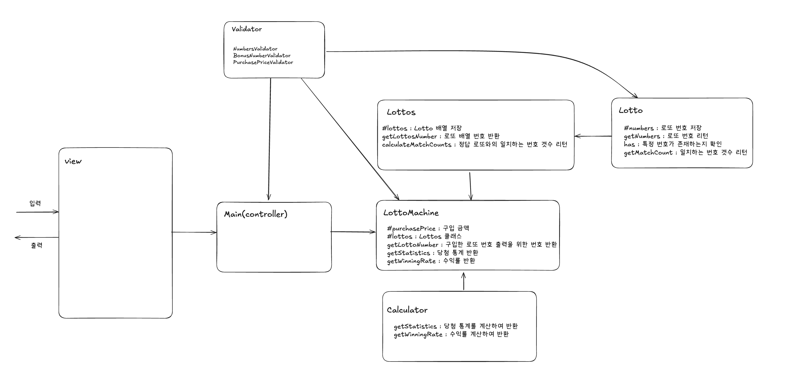

# ⚒️ 기능

- [x] 구입 금액 입력 받기
  - [x] 구입 금액 최소 금액 1000으로 나눠 떨어지는 자연수여야한다.
  - [x] 구입 금액은 최대 10,000,000,000이다.
- [x] 로또 구매하기
- [x] 로또 정보 출력하기
- [x] 당청 번호 입력받기
  - [x] 당첨 번호는 6개여야 한다.
  - [x] 당첨 번호는 중복되지 않아야 한다.
  - [x] 당첨 번호는 자연수여야 한다.
  - [x] 당첨 번호는 1~45 사이 수 여야한다.
- [x] 보너스 번호 입력받기
  - [x] 보너스 번호는 1~45 사이 자연수여야한다.
  - [x] 보너스 번호는 당첨 번호와 중복되지 않아야 한다.
- [x] 당첨 통계 출력하기
- [x] 다시 시작 입력받기

---

# ✏️설계

### 📁domain

**Main(controller)** : 프로그램의 전체 흐름(실행)을 담당하는 클래스입니다.

- LottoMachine과 output, input과의 상호작용을 수행합니다.

**LottoMachine** : Main에서 받은 데이터를 통해 Lottos, Calculator 클래스를 호출해 비즈니스 로직을 처리하는 클래스입니다.

- Main 클래스에서 여러 클래스를 의존하는 것 보다는 하나의 클래스만 의존하는 것으로 구현하는 것이 Main의 과부화를 줄일 수 있다고 생각하였습니다.

**Lottos** : Lotto 클래스의 배열을 저장하는 클래스입니다.

- 로또 배열을 저장하고 있어, 당첨 번호 일치 갯수와 보너스 번호 일치 여부를 해당 클래스에서 계산합니다.
  - getter를 사용하지 않고, 메시지를 보내는 것으로 해결하고자 했습니다.

**Calculator** : 당첨 통계 계산, 수익률을 계산하는 클래스입니다.

- 계산을 담당하는 클래스로 필드를 가지지 않아, 정적 필드로 선언했습니다.
- 객체로 선언하지 않은 이유는 프라이빗 메서드를 가지기 때문입니다. 객체로 선언했을 시, 외부에 공개하기 싫은 메서드도 공개될 수 있어 클래스로 선언했습니다.

**Lotto** : 로또 번호를 저장하고, 로또 번호를 가지고 필요한 로직을 처리하는 클래스입니다.

**validator** : 사용자 입력의 유효성 검사를 수행하는 클래스입니다.

- BonusNumberValidator : 보너스 번호 유효성 검사 클래스
- NumberSValidator : 로또 번호 유효성 검사 클래스
- PurchasePriceValidator : 구입 금액 유효성 검사 클래스
  - Calculator와 마찬가지로 프라이빗 메서드를 가지기 때문에 클래스로 선언했습니다.

### util

**errorHandler** : 잘못된 입력이 입력된 경우 다시 입력을 받는 로직 저장

**parser** : 사용자 입력의 파싱하는 함수를 모아 놓은 객체

**validationUtil** : 유효성 검사 로직에 공통으로 사용되는 로직을 모아 놓은 객체

### view

**output** : 출력을 담당하는 객체

**input** : 입력을 담당하는 객체

---

# 🗾설계도

